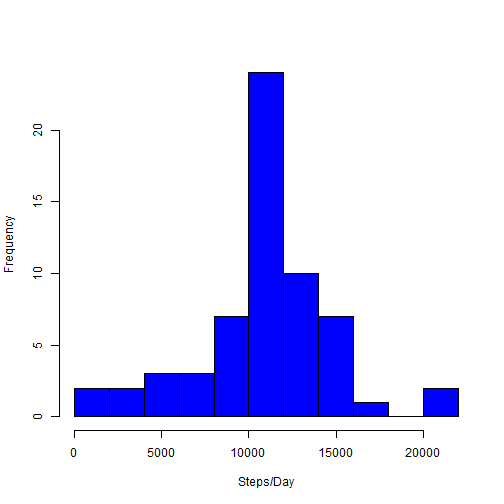

```r
library(knitr)
opts_chunk$set(echo = TRUE, results ="show")
library(dplyr)
```

```
## 
## Attaching package: 'dplyr'
## 
## The following object is masked from 'package:stats':
## 
##     filter
## 
## The following objects are masked from 'package:base':
## 
##     intersect, setdiff, setequal, union
```

```r
library(ggplot2)
library(lubridate)
library(stringr)
```

##Loading and preprocessing the data


```r
setInternet2(use=TRUE)
temp <- tempfile()
fileUrl <- "https://d396qusza40orc.cloudfront.net/repdata%2Fdata%2Factivity.zip"
download.file(fileUrl, temp)
```

```
## Warning in download.file(fileUrl, temp): downloaded length 53559 !=
## reported length 53559
```

```r
ActivityData <- read.csv(unz(temp, "activity.csv"))
unlink(temp)
```

## What is mean total number of steps taken per day?


```r
ActDataNoNA <- na.omit(ActivityData) ##simply ignoring the na data
ActivityByDay <- summarise(group_by(ActDataNoNA, date), tStep = sum(steps))
hist(ActivityByDay$tStep,xlab = "Steps/Day", col = "blue", main= "", breaks=10)
```

 

###Mean Steps per day


```r
print(mean(ActivityByDay$tStep))
```

```
## [1] 10766.19
```

###Median Steps per day


```r
print(median(ActivityByDay$tStep))
```

```
## [1] 10765
```

##What is the average daily activity pattern?


```r
ActivityByInt <- summarise(group_by(ActDataNoNA, interval), mstep = mean(steps, na.rm=TRUE))
timecol <- ymd_hm(paste("2001-01-01", str_pad(ActivityByInt$interval, 4, pad="0")))
ActivityByInt <- cbind(ActivityByInt, timecol)
with(ActivityByInt, plot(x=timecol, y=mstep, xlab="Time Interval", ylab="Mean Steps", type="l"))
```

 

###5-minute interval with the highest avg. number of steps


```r
print(subset(ActivityByInt, mstep==max(ActivityByInt$mstep), select="interval"), drop=TRUE)
```

```
##     interval
## 104      835
```

The time interval with the highest average number of steps is 8:35, that average is 206.17 steps.

##Inputting missing values

###Total NA observations


```r
print(sum(is.na(ActivityData)))
```

```
## [1] 2304
```


```r
DataNArep <- cbind(ActivityData, mstep = ActivityByInt$mstep)
DataNArep[,"steps"] <- ifelse(is.na(DataNArep$steps)==TRUE, as.integer(DataNArep$mstep), DataNArep$steps)  ##Formula replaces all NA values with the mstep (mean steps) value for that interval 
DataNArep <- DataNArep[,-4]
DatabyDay <- summarise(group_by(DataNArep, date), tStep = sum(steps, na.rm=T))
hist(DatabyDay$tStep,xlab = "Steps/Day", col = "blue", main= "", breaks=10)
```

 

###Mean with NAs replaced


```r
print(mean(DatabyDay$tStep)) 
```

```
## [1] 10749.77
```

###Median with NAs replaced


```r
print(median(DatabyDay$tStep))
```

```
## [1] 10641
```

Before inputting the missing values we were underestimating the mean and median steps per day.

## Are there differences in activity patterns between weekdays and weekends?


```r
DataNArep[,2] <- ymd(DataNArep$date)
DataNArep <- cbind(DataNArep, weekday = weekdays(DataNArep$date))
DataNArep[,4] <- ifelse(DataNArep[,4] %in% c("Saturday", "Sunday"), "weekend", "weekday")
DataNArepInt <- summarise(group_by(DataNArep, interval, weekday), mstep = mean(steps))
timecol <- ymd_hm(paste("2001-01-01", str_pad(DataNArepInt$interval, 4, pad="0")))  
DataNArepInt <- cbind(DataNArepInt, timecol)
qplot(timecol, mstep, data=DataNArepInt, facets=weekday~., geom="line", xlab="Interval", ylab="Number of steps") 
```

 
